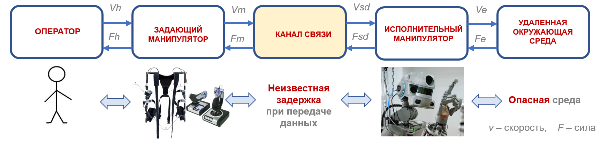
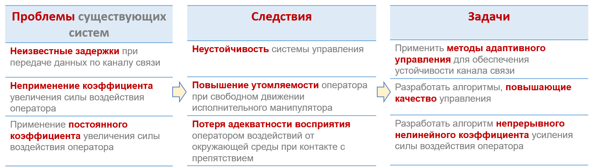
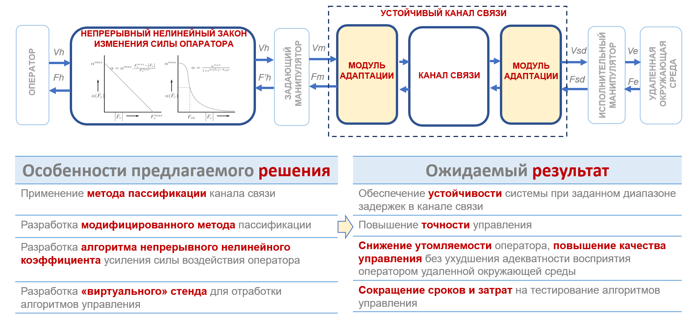

<head>
 <link rel="shortcut icon" href="/figures/favicon.ico" type="image/x-icon">
</head>

## Цель проекта

Целью проека является разработка системы дистанционного управления манипулятором с тактильным интерфейсом, предназначенного для решения сложных технических задач в опасных и труднодоступных для человека условиях.

_Рис.1 - Структурная схема системы дистанционного управления манипулятором_

_**Работа выполнена при поддержке гранта Фонда содействия инновациям УМНИК и гранта РФФИ 20-38-90261**_

## Состав системы управления

Система управления включает в себя:
* **задающее устройство** – манипулятор, с помощью которого человек-оператор сможет управлять удаленным исполнительным устройством;
* **исполнительное устройство** – манипулятор, с помощью которого осуществляется выполнение раьот в опасных средах;
* **канал связи** – канал передачи данных между задающим и исполнительным устройством.

Исполнительный манипулятор выбирается в соответствии с требованиями заказчика и выполняемыми задачами. 
Задающее устройство имеет идентичную кинематику с исполнительным манипулятором. 
В качестве канала связи может быть выбрано любое телеметрическое устройство (RS-232, RS-422/485, Ethernet, оптоволокно, радиочастота) в зависимости от требований заказчика и сферы применения.

#### Характеристики системы

1.	Возможность управления манипулятором, установленном на подвижной базе;
2. Силомоментная обратная связь;
3.	Возможности управления исполнительным манипулятором при средней задержки передачи сигнала 100 мс;
4.	Снижение утомляемости оператора в процессе работы с системой при свободном движении исполнительного манипулятора минимум в 2 раза по сравнению с аналогами;
5. Ошибка позиционирования задающего манипулятора не более 1,5 см;
6. Инвариантность к каналу сввязи;
7.	Обеспечение адекватности восприятия оператором сил воздействия удаленной среды без потери устойчивости управления.

С помощью системы управления оператор сможет осуществлять дистанционное управление исполнительным манипулятором и выполнять сложные технические работы в опасных и труднодоступных условиях.

## Проблемы существующих систем

## Предлагаемое решение

## Основные публикации и доклады

1. Козлова Н.Ю., Фомичев А.В. Разработка системы дистанционного управления космическим роботом-манипулятором с силомоментным очувствлением // XLIII Академические чтения по космонавтике, посвященные памяти академика С.П. Королева и других выдающихся отечественных ученых –  пионеров освоения космического пространства (Москва, 29 января – 1 февраля 2019 г.): сборник тезисов: в 2 т. / Российская академия наук, Государственная корпорация по космической деятельности «Роскосмос», Комиссия РАН по разработке научного наследия пионеров освоения космического пространства; Федеральное государственное бюджетное образовательное учреждение высшего образования «Московский государственный технический университет имени Н.Э. Баумана (национальный исследовательский университет)». — Москва: Издательство МГТУ им. Н.Э. Баумана, 2019. С. 103 – 105.
2. Kozlova N., Fomichev A. Development of the remote control system of the free-flying space manipulation robot with force feedback.  AIP Conference Proceedings 2171, 150005 (2019); https://doi.org/10.1063/1.5133303 Published Online: 15 November 2019
3. Козлова Н.Ю., Фомичев А.В. Повышение эффективности дистанционного управления свободнолетащим космическим манипуляционным роботом. XII мультиконференция по проблемам управления (МКПУ-2019): материалы XII мультиконференции (Дивноморское, Геленджик,  23-28 сентября 2019 г.): в 4 т. - Ростов-на-Дону; Таганров: Издательство Южного федерального университета, 2019 г., т. 4, С. 47-49.
4. XLIV Академические чтения по космонавтике, посвященные памяти академика С.П. Королёва и других выдающихся отечественных ученых — пионеров освоения космического пространства (Москва, 28—31 января 2020 г.) : сборник тезисов : т. 2  — Москва : Издательство МГТУ им. Н.Э. Баумана, 2020. С. 218 - 220
5. Козлова Н.Ю., Фомичев А.В. Методы повышения эффективности дистанционного управления свободнолетащим космическим манипуляционным роботом. Известия ЮФУ. Технические науки. 2019. № 7 (209). С. 189-200

## Об авторе проекта

| | Наталия Козлова                                                         |
|:---------------------|:------------------------------------------------------------------------|
|                      |асипарант МГТУ им. Н.Э. Баумана, инженер НИЧ НУК ИУ МГТУ им. Н.Э. Баумана|
|                      |e-mail: k.natalia.bmstu@gmail.com                                        |
